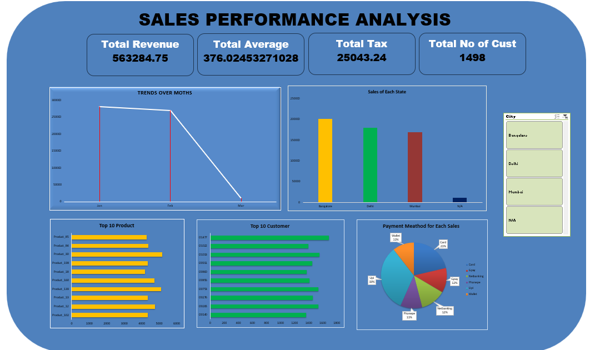

# Zepto Sales Performance Analysis

An end-to-end sales analysis of quick-commerce grocery order data — cleaning a messy raw export, building an interactive dashboard, and turning the results into business insights and recommendations.

## 📌 Problem Statement

Zepto (a quick-commerce grocery delivery platform) generates a continuous stream of order-level transaction data across cities, product categories, customer segments, and payment modes. This project analyzes that data to answer:

- Which product categories and SKUs drive the most revenue?
- Which customer segments contribute most to sales?
- How does performance vary by region and payment mode?
- Is there a visible month-on-month trend or seasonal pattern?
- What operational issues (cancellations, substitutions, refunds) are affecting realized revenue?

## 📂 Repository Contents

| File                                           | Description                                                                                                                                                    |
| ---------------------------------------------- | -------------------------------------------------------------------------------------------------------------------------------------------------------------- |
| `dataset/zepto_sales_raw.xlsx`               | Raw, uncleaned transactional export — 1,500 orders, 28 columns                                                                                                |
| `Zepto_Sales_Performance_Documentation.docx` | Full project write-up: problem statement, dataset description, data cleaning process, dashboard design, key insights, business recommendations, and conclusion |
| `Dashboard.png`                              | Dashboard preview                                                                                                                                              |

## 🗂️ Dataset

- **1,500 orders**, **300 distinct customers**
- **3 cities**: Bangalore, Delhi, Mumbai (plus a small share of missing/`N/A` city data)
- **Date range**: 1 Jan 2025 – 1 Mar 2025
- **Key fields**: order & customer details, city/pincode, payment method, SKU/product/category, price/discount/tax/total, delivery slot/warehouse/status, refunds & reasons

The raw file is intentionally messy — mixed date formats, inconsistent payment-method spelling, category typos/casing issues, and currency symbols embedded in numeric fields — to reflect a realistic real-world export.

## 🧹 Data Cleaning

Before analysis, the following was addressed (full detail in the documentation file):

- Standardized `Order_Date` from 3 different formats into a single date type
- Normalized `Payment_Method` (e.g. `UPI` / `upi` / `UP I` → `UPI`)
- Normalized `Category` typos and casing into 10 standard categories (Veg, Fruits, Dairy, Frozen, Snacks, Bakery, Beverages, Essentials, Baby, Other)
- Stripped the ₹ symbol from `Price` and converted it to numeric
- Kept blank `City` values as an explicit `N/A` bucket instead of dropping rows
- Verified `Order_ID` uniqueness and left legitimately-empty fields (e.g. `Delivery_Time`, `Reason`) as nulls

## 📊 Dashboard

A single-page dashboard summarizes performance across every dimension:

- **KPI strip** — Total Revenue, Average Order Value, Total Tax, Total Orders
- **Trends over Months** — order value trend across Jan/Feb/Mar
- **Sales by State** — regional performance
- **City filter** — slice every visual by region
- **Top 10 Products & Top 10 Customers** — SKU and account-level concentration
- **Payment Method breakdown** — revenue share by payment mode

## 🔑 Key Insights

- **Beverages, Frozen, and Veg** are the top revenue categories (~40% of total revenue combined)
- **Bulk customers** drive ~83% of total revenue — a concentration risk
- **Bangalore** leads regional revenue, with Delhi and Mumbai close behind (~16% gap top-to-bottom)
- **UPI** dominates payment mode, generating more than double the revenue of the next-largest method
- **January and February are nearly flat** month-on-month — the steep March drop on the dashboard is a data-coverage artifact (only 1 day of March is in the dataset), not a real seasonal decline
- **16.3% of orders** end in Cancelled/Failed/Returned status rather than Delivered
- **Product substitution** affects ~48% of orders, highest in Essentials, Veg, and Baby categories
- **Refunds (₹72,763 total)** are driven mainly by stockouts, delivery delays, and customer cancellations

## 💡 Business Recommendations

- Prioritize inventory/safety stock for high-substitution categories (Essentials, Veg, Baby)
- Double down on top revenue categories (Beverages, Frozen, Veg) in marketing and placement
- Reduce dependence on Bulk accounts by growing New/Returning customer acquisition
- Investigate elevated order failure rates on NetBanking and Card payments
- Fix the checkout data-capture gap causing missing City values
- Standardize data entry (payment mode, category naming, price formatting) at the source to reduce recurring cleanup effort

See `Zepto_Sales_Performance_Documentation.docx` for the full analysis, tables, and reasoning behind each recommendation.

## 🛠️ Tools Used

- Excel (data cleaning, pivot analysis, dashboard/chart building)

## 📈 Status

✅ Data cleaning complete · ✅ Dashboard built · ✅ Insights & recommendations documented
